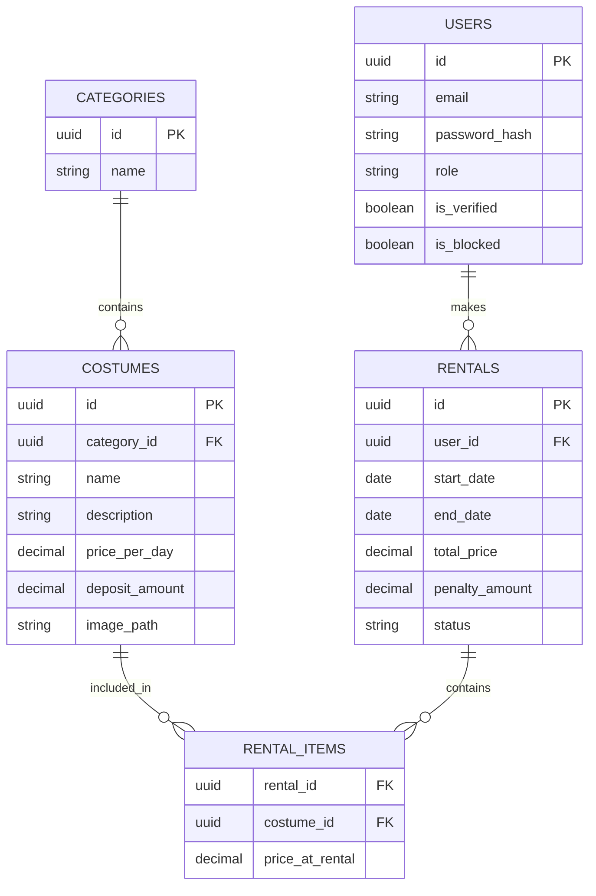

# Costume Rental Management System 🎭

Сучасна десктопна система для управління прокатом карнавальних костюмів, розроблена на JavaFX 23 з використанням багатошарової архітектури MVVM та реляційної бази даних H2.

## 🚀 Основні можливості

- **Каталог костюмів:** Перегляд, пошук та фільтрація за категоріями.
- **Управління кошиком:** Додавання костюмів, розрахунок вартості оренди та застави.
- **Система оренди:** Бронювання на обрані дати з перевіркою доступності.
- **Панель адміністратора:**
  - CRUD операції для костюмів та користувачів.
  - Управління статусами оренд (Заброньовано, Видано, Повернуто).
  - Дашборд зі статистикою популярності костюмів та статусами замовлень.
- **Безпека:** Реєстрація, авторизація з хешуванням паролів (jBCrypt) та верифікація акаунтів.
- **Фінанси:** Автоматичний розрахунок застави та штрафів за прострочення.

## 🛠 Технологічний стек

- **Java 23** (LTS)
- **JavaFX 22.0.1** (UI Framework)
- **H2 Database** (Embedded)
- **HikariCP** (Connection Pooling)
- **Flyway** (Database Migrations)
- **AtlantaFX** (Modern CSS Theming)
- **Lombok** (Boilerplate reduction)
- **JUnit 5 & Mockito** (Testing)

## 🏗 Архітектура

Проєкт реалізовано згідно з принципами **Clean Architecture** та **Layered MVVM**:

1.  **Presentation Layer:** JavaFX FXML + Controllers + ViewModels.
2.  **Business Logic Layer:** Services + Facades + Domain Models.
3.  **Data Access Layer:** Repository pattern (JDBC implementation) + Data Mappers.
4.  **Infrastructure:** Database Manager + Flyway Migrations.

## 📊 Схема бази даних (ER)



## 📦 Встановлення та запуск

1.  **Вимоги:** JDK 23+, Maven 3.9+.
2.  **Клонування:**
    ```bash
    git clone [repository-url]
    cd carnival-rental-app
    ```
3.  **Збірка:**
    ```bash
    ./mvnw clean package
    ```
4.  **Запуск:**
    ```bash
    ./mvnw javafx:run
    ```

## 🧪 Тестування

Запуск юніт-тестів та інтеграційних тестів:
```bash
./mvnw test
```

## 📝 Ліцензія

Проєкт розроблено в рамках навчальної практики з ООП.
Автор: Олійник Артем.
